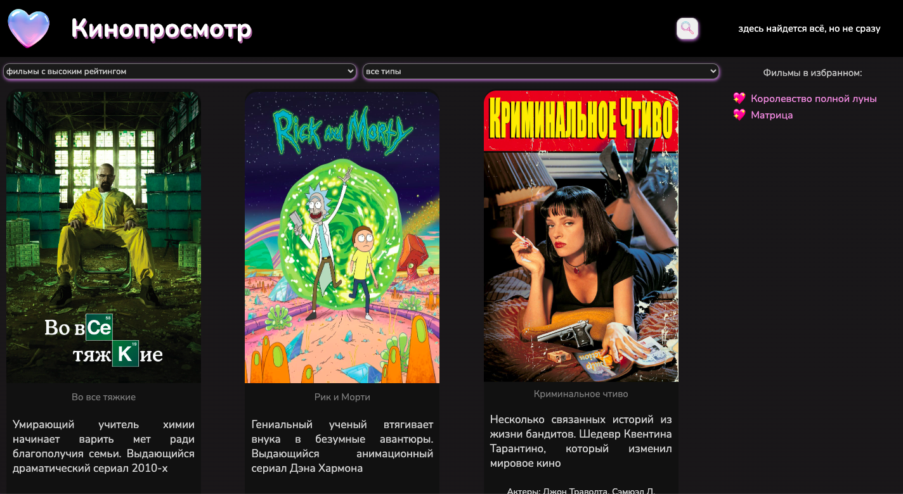
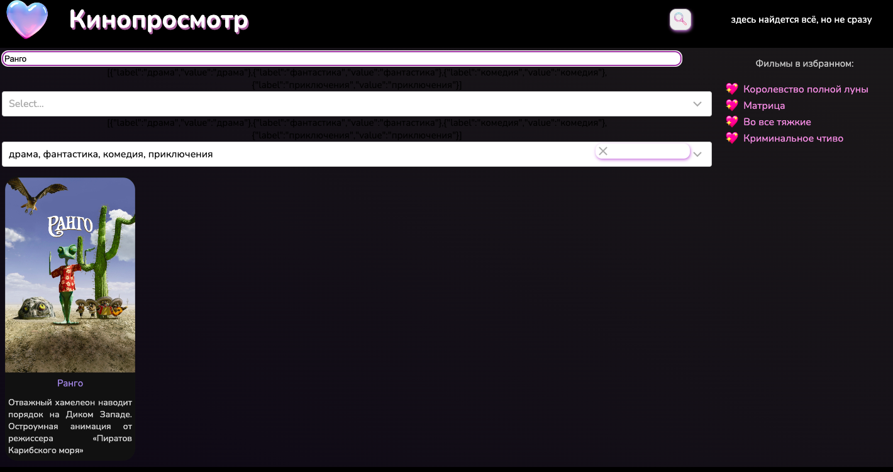

# Кинопросмотр 

Front-end приложение для поиска информации о фильмах и сериалах. 
***

## Стек технологий:
* React JS
* CSS

***
## API
Документация API: https://api.kinopoisk.dev/documentation 

***
## Структура и описание функционала проекта
* Приложение состоит из 3 страниц: главная страница располагается по url: "/films" , страница конткретного фильма по url: "/films/:id" , страница поиска по url: "/films/research". На всех 3-х страницах есть повторяющиеся компоненты: "Header", "Sidebar", "Footer".
        
        1. "Header": при нажатии на название приложения страница возвращается на главную; при нажатии на иконку поиска происходит переход на страницу расширенного поиска.
        2 "Sidebar": отражает добавленные в избранные фильмы (так как это front-end приложение, то добавление в избранное происходит через сохранение данных в браузере с помощью localStorage)
        3. "Footer": отражает краткую информацию об авторе проекта и способе связи.

* На главной странице по url: "/films" отражается контент, полученный по API (для данного проекта по API ограничилась получением 30 фильмов/сериалов).

        Функционал страницы:
        1. Есть возможность отсортировать контент по рейтингу imdb. (компонент Films)
        2. Контент можно отфильтровать по типу (фильмы, мультфильмы, мультсериалы, сериалы). (компонент Films)
        3. Карточка каждого фильма/сериала содержит в себе: название, постер, краткое описание, перечисление актеров, играющих главные роли, два ключевых жанра картины, рейтинг, кнопку добавления в избранное. При нажатии на название происходит переход на страницу конкретнго фильма/сериала. (компонент FilmsCard)

* На странице конткретного фильма/сериала по url: "/films/:id" :

        1. Общая информация о фильме/сериале: название, подробное описание, актеры, жанры, рейтинг, кнопка добавления в избранное. (компонент MoreAboutTheFilm, карточка фильма/сериала: компонент CardAboutFilm)
        2. Рекомендации к просмотру похожего контента. Жанры всех фильмов/сериалов сравниваются с жанрами контента на странице; в зависимости от количества схожих жанров ведется счетчик, с помощью сортировки (от большего к мееньшему) определяется список фильмов/сериалов, которые отразятся в рекомендациях. (компонент MoreAboutTheFilm, карточка фильма/сериала: компонент Recomendation)
        3. Комментарии: есть возможность оставить свой комментарий от имени "Анонимного пользователя" (компонент AddReview), просмотреть комментарии других пользователей (компонент Reviews)

* На странице поиска по url: "/films/research" осуществляется поиск интересующего контента. Изначально на странице отображаются все доступные фильмы/сериалы.

        1. Есть возможность найти необходимый фильм по названию, при этом регистр буквенных сиволов может быть любым (компонент Research, карточка контента в компоненте SearchCard). 
        2. Поиск можно конкретизировать выбором жанров и типов контента. (компонент Research, карточка контента в компоненте SearchCard)

***

***

